# Color-Camera-ISP-Pipeline--Python

1. Objective

The objective of this project is to design and implement a color camera image signal processing (ISP) pipeline to process images acquired under poor illumination nighttime conditions.

# 2. Motivation

In many real-time computer vision applications, the imaging data is typically acquired under variable illumination environment at time of the day, night and weather conditions. However, the performance of many of these critical system depends significantly on the image quality at all times and conditions. For instance, self-driving cars derive critical real-time decisions from the acquired data.  Thus, at all times, the imaged scene objects must be clearly visible and identifiable, especially objects or interest such as pedestrains, cyclists, vehicles, traffic lights and road signs.

In this project, we desigbn and implement a color camera image ISP pipeline to process images acquired under poor illumination nighttime conditions and ensure sufficiently good quality, which allows a computer vision system to detect and recognize objects of interest. 

# 2. The input Images

We shall illustrate the performance of our proposed ISP pipeline using using 2 input images that are in companded RAW format, that need to be ingested before we can visualize them. 

# 3. Approach

The proposed ISP pipeline is illustrated in the figure below.

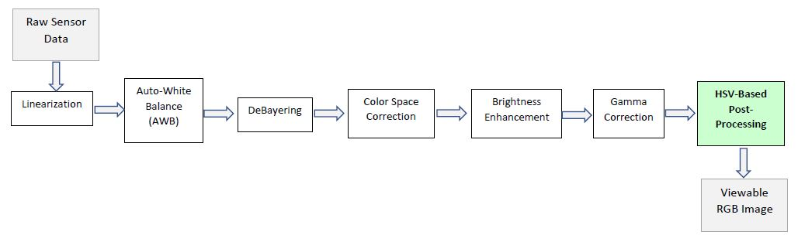

Next, we shall illustrate the poutput of each module. 

demonstrated in the submitted code, we implemented the following 3-step process to generated high-resolution 2D images from the relatively sparse 3D point cloud, illustrated in the fugure above:

## 3.1 Linearization

When acquired by the camera, the images are stored in companded RAW format to disk. First, they need to be linearized and normalized and properly reshaped for further processing.   The figures below illustrated the output of the linearization module.

  

    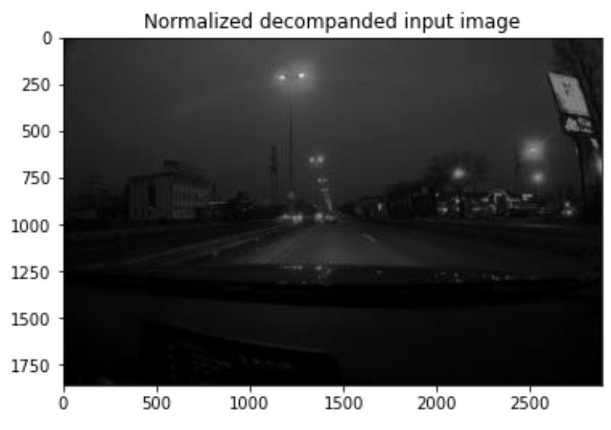
  

  

    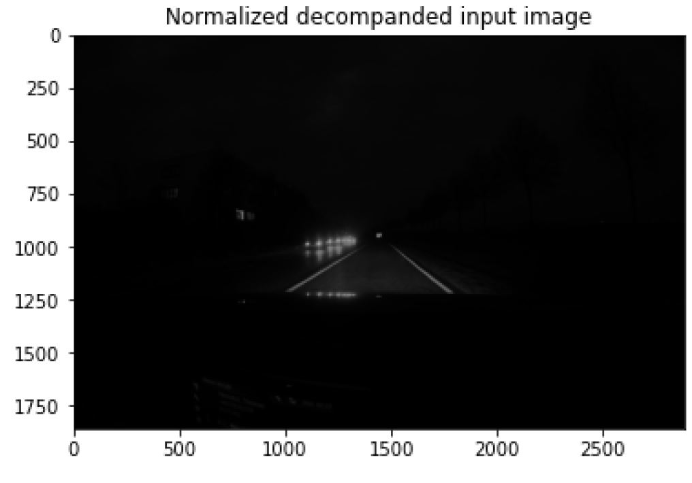
  

## 3.2 Auto-White Balancing

Without some kind of adjustment and human intervention, digital cameras typically capture unrealistic images with a strong color cast. Automatic white balance (AWB) algorithms try to correct for the ambient light with minimum input from the user, so that the resulting image looks like what our eyes would see. 

We compute AWB weights for each of the R, G, B channels based on one of the following 2 methods, as selected by the user:
*  Gray-World Assumption
* White-World Assumption.

The figures below illustrated the output of the AWB module.

  

    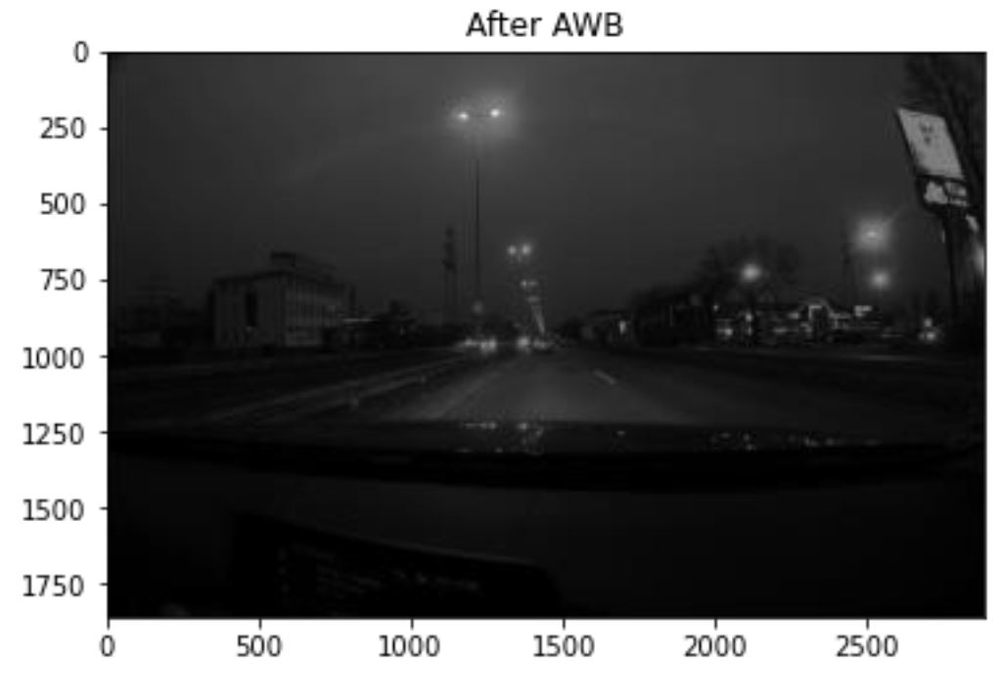
  

  

    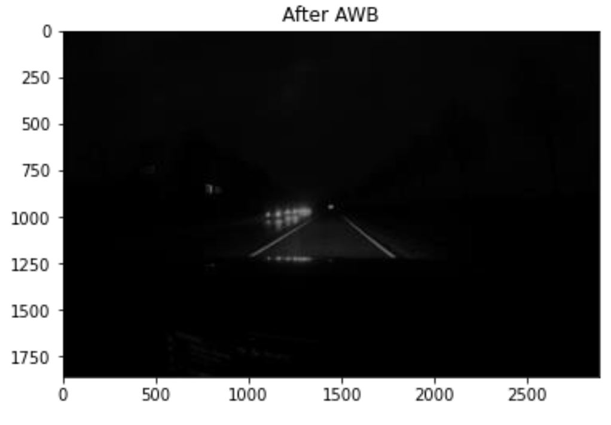
  

## 3.3 DeBayering

DeBayering, also known as demosaicing is a digital image processing algorithm used to reconstruct a full color image from the incomplete color samples output from an image sensor overlaid with a color filter array (CFA). The figures below illustrated the output of the Debayering module.

  

    
  

  

    
  

## 3.4 Color Correction

After applying the Debayering algorithm, the RGB images are now viewable. However, its pixels will not have coordinates in the correct
RGB space that is expected by display system. The pixel’s RGB values need to be converted to some color basis
which the display monitor expects. This is done by a linear transformation, so we will need to apply a 3x3 matrix transformation to each of the pixels. The correct matrix to apply can be difficult to find. We use Adobe color conversion matrices which transform from the camera’s color space to the XYZ color space, a common standard. Then the transformation from XYZ to the desired output space, sRGB, can be applied. We can also combine these two transformations and then apply them at once.

The figures below illustrated the output of the Debayering module.

  

    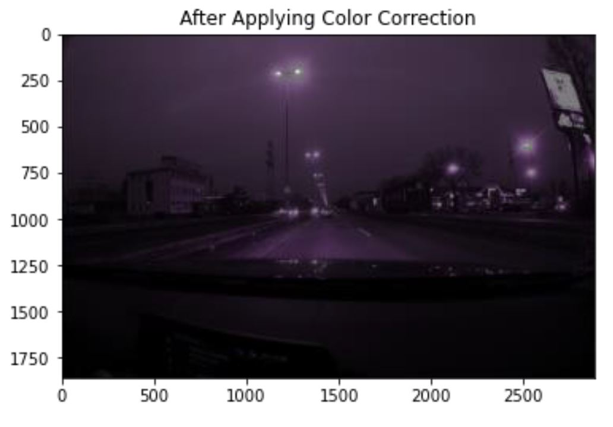
  

  

    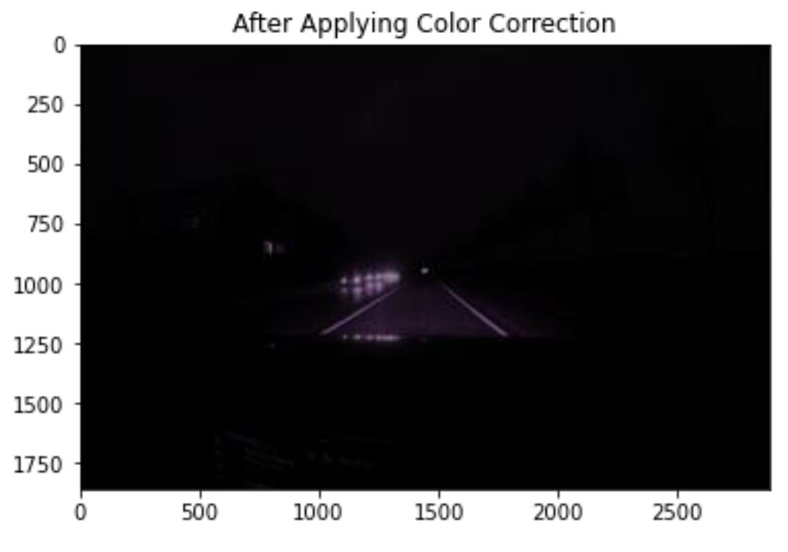
  

## 3.5 Brightening

We now have a 16-bit, RGB image that has been color corrected and exists in the right color space for display. However, its pixel values may not be in a range appropriate
for being displayed. We can brighten the image by simply scaling it. Next, we apply a simple brightening approach which ensures that the mean luminance of the image is scaled  to a reasonable value.

The figures below illustrated the output of the Debayering module.

  

    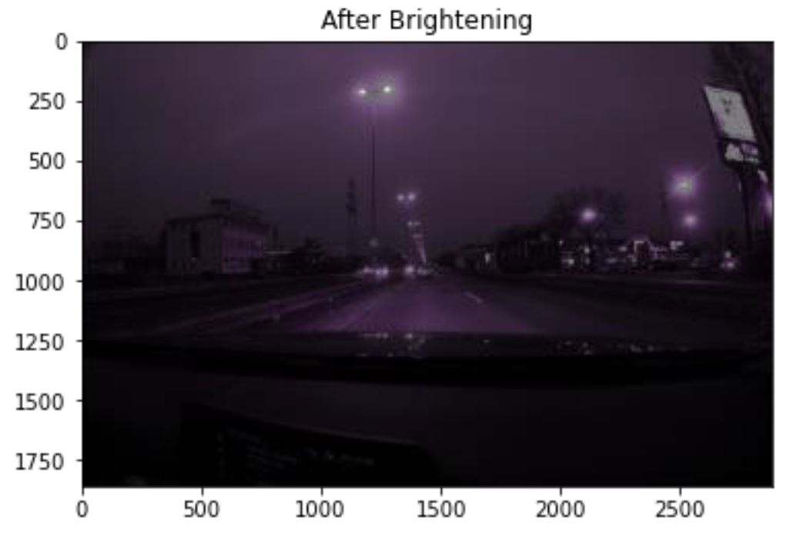
  

  

    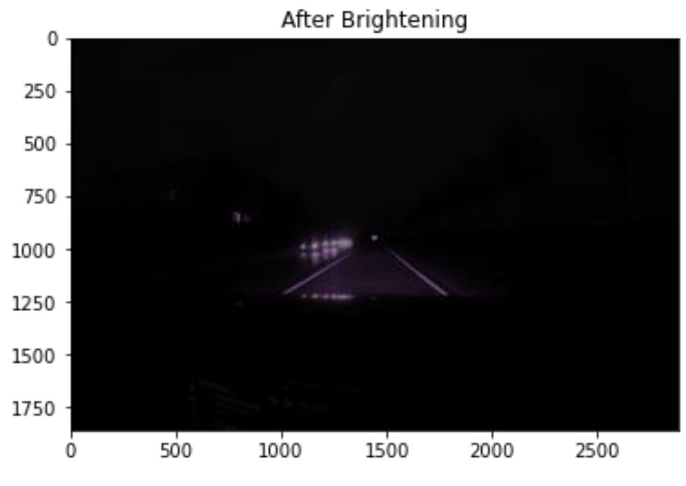
  

## 3.6 Gamma Correction

At this point, the image is still linear, which is not suitable # for display (dark areas will appear too dark). We will apply a “gamma correction” power function to this image
as a simple way to fix this with typical: gamma_value = 1/2.2.

The figures below illustrated the output of the Debayering module.

  

    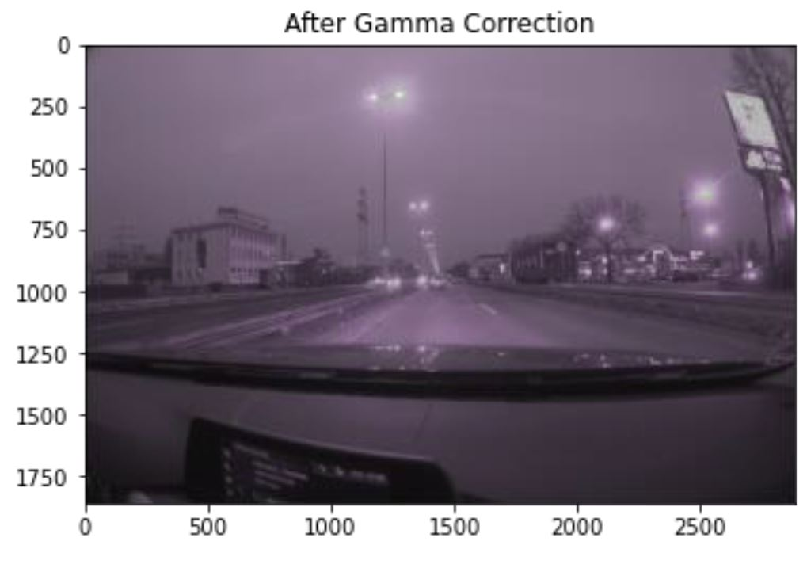
  

  

    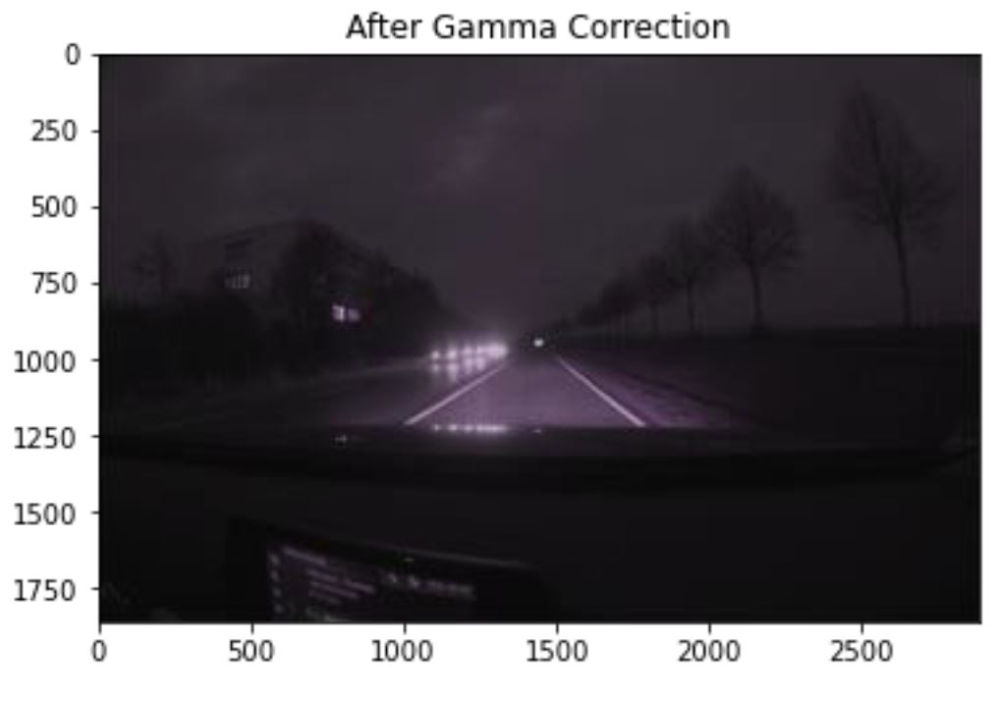
  

## 3.6 HSV-Based Post-Processing

Finally, we apply HSV-Based Post-Processing in order to:
* Reduce mangenta cast
* Enhance contrast

This involves the following steps:
1. Convert from RGB to HSV color space and get the Value-channel:
*   The RGB is converted to the HSV color space

2. Apply Contrast-Enhancement via Adaptive Histogram Equalization on the Value-Channel ONLY:
* We apply localized Adaptive Histogram Equalization on the Value-channel to enhance details over small areas in an image rather than the whole image.
* The Adaptive Histogram Equalization is applied ONLY on the Value-channel, because it corresponds to illumintaion and brightness measurement
* This is done by applying a transformation function that is derived from the neighborhood of every pixel in the image 
* This is exactly what Adaptive Histogram Equalization (AHE) in OpenCV does:
  * In Adaptive Histogram Equalization (AHE), the image is divided into small blocks called “tiles”:  
  *  Tiles of size 8×8 is a common choice).=
  *  Then each of these blocks is histogram equalized.
  *  Finally, the enhanced blocks together using bilinear interpolation.

3. Suppress the Hue and Saturation pixel-values to reduce the magenta cast artifacts
* Magenta color has high Hue and Saturdation pixel values
* Suppressing the values of Hue and Saturation should reduce the magenta artifacts:
* Hue can be reduce via a shift function (subtraction)
* Saturation can be reduved via a root-function.

4. Convert from HSV to RGB aflter applying Adaptive Histogram Equalization on the Value-Channel.

The figures below illustrated the output of the Debayering module.

  

    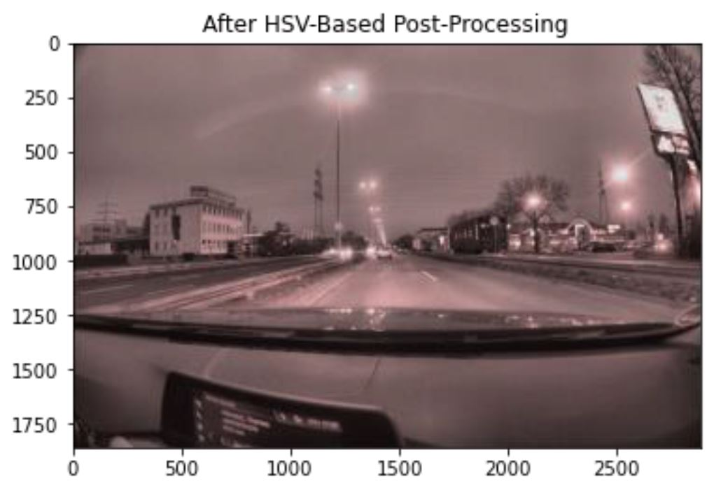
  

  

    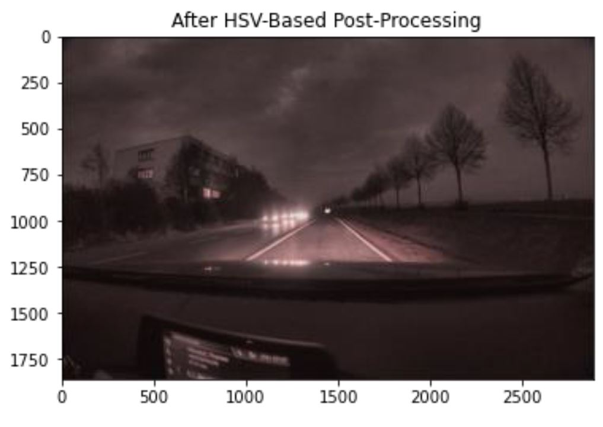
  

4. Conclusion

Inthis project, we designed and implemented a color camera image signal processing (ISP) pipeline to process images acquired under poor illumination nighttime conditions. We illustrated the output of each module of the pipeline and demonstrated that final output image has significantly better quality and its scene contents can easily be detected and recognized by the human eyes as well as autkmated computer vision systems, inspite of the challenging nighttime illumination conditions.  

